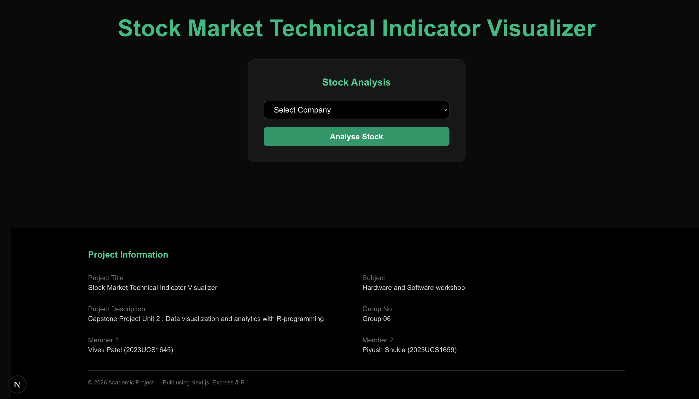
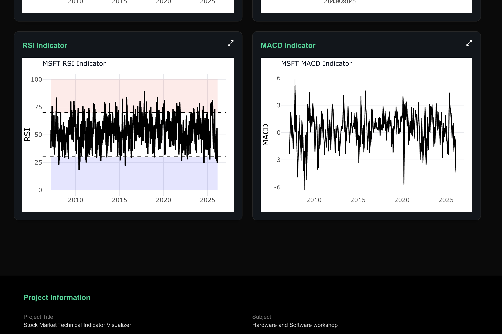
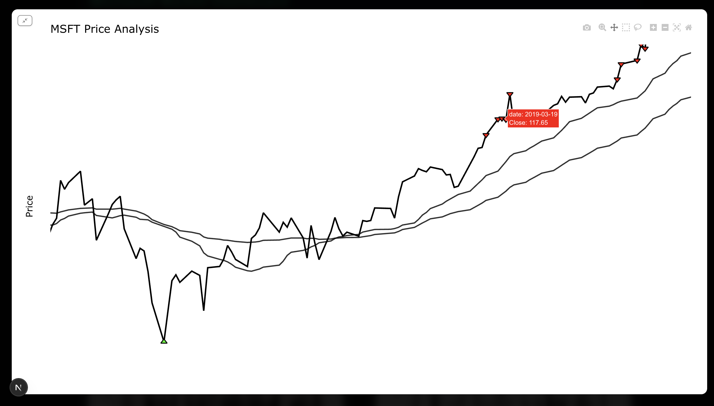

# Stock Analysis using R Programming

- **Description** : This project utilises R - programming to analysis the stocks and other technical indicators using R programming.

- **Tech Stack Used** : 
    - **Frontend** : NextJs with Typescript is used to visualise the graphs (using react-ploty.js)
    - **Backend** : ExpressJs with Trypscript and R programming .
    - **Api** : Used the quantmod package of R programming to fetch real time data from yahoo finance .

### Demo

     

     

     

### Author

**Made by Vivek Patel**